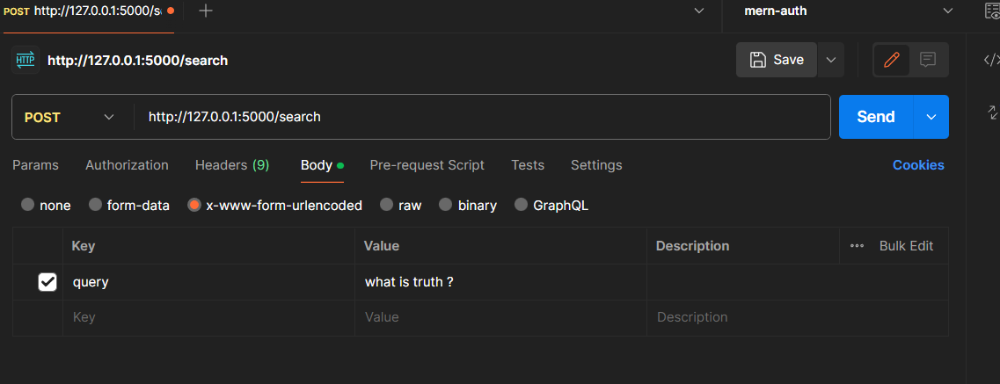

# Ask Sai-Baba

## Installation

1. Navigate to the backend directory using the command line.
2. Install the required packages by running the following command in your terminal:

```bash
pip install -r requirements.txt
```

## Usage

1. Run the script `app.py` using the following command:

```bash
python app.py
```

## Testing with Postman

1. Open Postman and enter the URL `http://127.0.0.1:5000/search`.

2. Set the request method to POST.

3. In the Body panel, select `x-www-form-urlencoded`.

4. Add the key-value pair for your query.



5. Click Send to run the query.

## Viewing Logs

1. After sending the query, check the return of the api call inside postman
